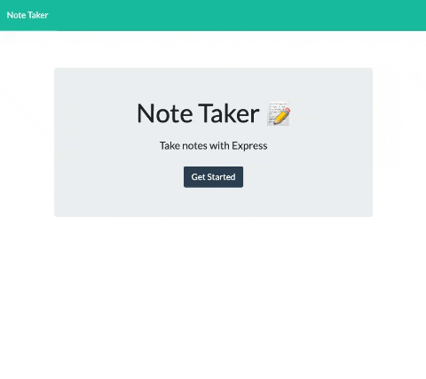

# Note Taker
  

<a href="https://tomarapetty.github.io/note-taker/">Click here to see it in action.</a>

## Table of Contents
* [Description](#description)
* [Installation](#installation)
* [Usage](#usage)
* [License](#license)
* [Contributions](#contributions)
* [Tests](#tests)
* [Questions](#questions)

## Description 
*Overview of this project:* 
* The note taker app allows users to be able to write and store notes. Notes can be saved for later or deleted if a note is no longer needed. 

## Installation
*Steps required to install project and get the development environment established:*
* Clone this repo. App will not deploy server side code on GitHub and thus will need to be deployed on Heroku in order to run properly.

## Usage
*Instructions and examples for use:* 
* Click into the text box to start typing a note. Click the save icon to save. Once a note is saved you can click the gabage can icon to delete it.

## License 
* Built under the MIT licence.

## Credits
* Built & designed by Tomara Petty

## Test
* No tests.

## Questions?

 
If you have any questions or want to make a contribution please reach out to me here: 

* GitHub: @tomarapetty 
* Email: tomara.petty@gmail.com
* LinkedIn: https://www.linkedin.com/in/tomara-petty/